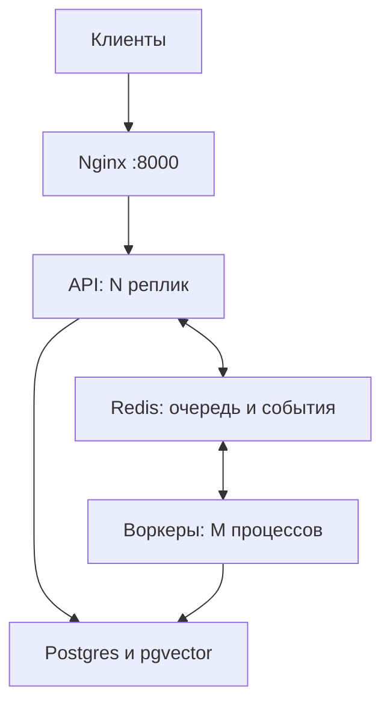

# Масштабирование, очередь, поиск, надёжность

## Топология production



`docker compose up -d --build --scale app=2 --scale worker=4` — API и воркеры масштабируются независимо.

| Режим | Настройки | Когда |
|---|---|---|
| dev / один инстанс | `MESSAGE_MODE=sync` или `queue` + `QUEUE_BACKEND=inprocess` | ноутбук, тесты |
| production | `MESSAGE_MODE=queue`, `QUEUE_BACKEND=redis`, `REDIS_URL=…`, `EMBEDDED_WORKER=false` на API, отдельные `python -m app.worker` | несколько реплик |

### Персистентная очередь
* Каждая джоба — строка `ingestion_jobs` (Postgres) **и** запись в Redis-очереди. Источник истины — БД.
* Воркер забирает джобу атомарно (`BLMOVE` в список «processing» + heartbeat). Если процесс умер, «застрявшие» джобы
  (нет heartbeat дольше `JOB_STALE_SECONDS`) возвращаются в очередь другим воркером; повторная постановка защищена compare-and-set
в БД, поэтому несколько reaper'ов и долгий backlog не размножают сообщения в очереди. При graceful-остановке воркер сам возвращает
джобу (`processing → accepted`) без траты попытки, а при недоступности Redis на приёме джоба остаётся в БД и подхватывается позже — **при рестарте джоба не уходит в `failed`**.
* Повторы: до `JOB_MAX_ATTEMPTS`; после — `failed` с понятным текстом. Идемпотентность по `correlation_id`
  (повторная доставка вебхука платформы не создаёт дубль).
* При старте `InProcessRunner` тоже подбирает незавершённые джобы из БД (`accepted`/`processing`).
* Готовность: `GET /ready` (БД + Redis); `Dockerfile` содержит `HEALTHCHECK`.

### События и отмена между процессами
* Прогресс (`status`, `token`, `tool_call`, `tool_start`, `tool`, `done`, `cancelled`, `error`) публикуется в Redis pub/sub
  (`EventBus`), SSE-эндпоинт любой реплики отдаёт поток; если джоба уже завершена, эндпоинт отдаёт финальное состояние из БД.
* «Стоп»: `POST /v1/jobs/{id}/cancel` (веб/мобайл) или `/stop` (Telegram/Slack/Discord/WhatsApp) → флаг + Redis-сигнал; воркер,
  держащий джобу, отменяет asyncio-задачу. Частичный ответ сохраняется в историю с пометкой `…[остановлено]`.

### Поиск (pgvector)
* На Postgres вектор пишется в `chunks.embedding_vec` (`vector(PGVECTOR_DIMENSIONS)`, HNSW-индекс, cosine); JSON-эмбеддинг
  не хранится. Размерность модели ≠ `PGVECTOR_DIMENSIONS` → чанк остаётся в JSON-колонке (SQLite/dev-путь), поиск не ломается.
* Запрос гибридный: векторный top-K (`<=>`) + текстовый (`ILIKE` по тексту чанка) → слияние **RRF**. Ответ помечает, чем найдено
  (`source: vector|text`).
* Перенос существующих данных: миграция `c3a1f0d2b7e4` переносит JSON-эмбеддинги в `embedding_vec`; `python -m app.rag.reindex`
  повторяет перенос для оставшихся/импортированных строк (идемпотентно), индексирует сущности без чанков, а `--force` пере-эмбеддит всё
  (после смены модели эмбеддингов).
* SQLite (dev) — косинус в Python, как раньше.

### Запуск нескольких реплик
* Compose запускает отдельный сервис `migrate`; API и воркеры ждут его успешного завершения. В production `init_db()` проверяет версию Alembic и не создаёт схему. В development сохраняется `create_all`.
* Только Nginx публикует порт 8000; API можно масштабировать без конфликтов портов. Healthcheck воркера проверяет его Redis heartbeat.
* Планировщик напоминаний работает в каждой реплике API, но строка `ReminderNotification` «занимается» (unique) **до** отправки —
  сообщение уходит ровно один раз. Для тяжёлых установок можно оставить `REMINDERS_ENABLED=true` только на одной реплике.
* Подтверждение факта берёт блокировку строки (`SELECT … FOR UPDATE`): двойное нажатие (веб + Telegram) создаёт одну запись.

### Надёжность внешних вызовов
* Все исходящие HTTP (LLM, эмбеддинги, STT, Telegram/Slack/WhatsApp/Discord) идут через `app.net.request_json`: retry с
  exponential backoff + jitter (`HTTP_RETRY_*`), уважает `Retry-After`, ретраит 429/5xx/сетевые ошибки, не ретраит 4xx.
* LLM: семафор `LLM_MAX_CONCURRENCY` на процесс + квота на пользователя `RATE_LIMIT_LLM_PER_MINUTE` (429 `rate_limited` + `Retry-After`
  для веба, вежливое сообщение в каналах). При `REDIS_URL` лимитеры общие для всех реплик (fixed-window в Redis), иначе in-process.
* Фолбэк на облачный endpoint — только с `LLM_ALLOW_LOCAL_FALLBACK=true`.

## Обновление существующей установки

Сначала сделайте резервную копию БД и blob-хранилища. Для БД с Alembic:

```bash
cd backend
alembic upgrade head
```

В Compose миграции выполняются автоматически перед запуском приложения. Сохраните прежний пароль
`POSTGRES_PASSWORD`: изменение переменной не меняет пароль уже созданного PostgreSQL volume.
Если БД создавалась только через `create_all`, сначала сопоставьте её фактическую схему с миграциями
и выполните `alembic stamp <соответствующая_ревизия>`. Не отмечайте произвольную ревизию:
для полной схемы предыдущего релиза это `e5c7d9b2a1f4`, затем `alembic upgrade head`.

Новая миграция добавляет уникальный ключ доставки, сохраняя существующую историю и старые дубли.
`python -m app.rag.reindex --force` восстанавливает текст документов из исходных файлов;
при отсутствии файла операция откатывается. После смены модели эмбеддингов нужен полный reindex.
`python -m app.security.rekey` запускайте с новым ключом первым и всеми ещё необходимыми старыми ключами.

Postgres должен быть с расширением `vector` (образ `pgvector/pgvector:pg16`; миграция делает `CREATE EXTENSION IF NOT EXISTS vector`,
для этого нужны права суперпользователя или предустановленное расширение).

## CI и evals

* `ci.yml`: `backend` (ruff, mypy, pytest на SQLite, scripted evals, alembic smoke), `backend-postgres` (pgvector + Redis
  сервисы, весь набор тестов на Postgres, `tests/redis_smoke.py` на настоящем Redis), `mobile` (tsc + jest).
* `evals-live.yml`: **live-evals с настоящей LLM** — ночью (cron), при изменениях `agent/domains/llm/rag/evals`, вручную
  (`workflow_dispatch`: `runs`, `model`). Нужен секрет `EVAL_LLM_API_KEY`, опционально переменные репозитория
  `EVAL_LLM_BASE_URL`, `EVAL_LLM_MODEL`, `EVAL_EMBEDDING_MODEL`. Без секрета шаг честно пропускается (в отчёте — SKIPPED).
  Каждый кейс прогоняется `--runs N` раз; порог `--min-pass-rate` (по умолчанию 0.8 для live, 1.0 для scripted). Оценка live —
  по траектории инструментов (ожидаемые ⊆ вызванных, `forbid_tools`), по post-condition проверкам БД и по ключевым словам
  ответа; markdown-отчёт пишется в Job Summary, JSON — артефактом `evals-live-report.json`.
* Локально: `python -m evals.runner --live --runs 3 --min-pass-rate 0.8`.

## Совместимость поиска после обновления

Миграция `a8b3c9d002` добавляет идентификатор пространства эмбеддингов. Он учитывает
провайдера, URL, модель и `EMBEDDING_REVISION`. Старые векторы без идентификатора остаются
доступны через текстовый поиск; для восстановления семантического поиска выполните
`python -m app.rag.reindex --force`. Если за прежним именем локальной модели заменены веса,
увеличьте `EMBEDDING_REVISION`, перезапустите API/воркеры и выполните переиндексацию.
Исходные файлы документов должны быть доступны в blob-хранилище.

CI дополнительно проверяет обновление заполненной PostgreSQL-БД с прежней ревизии,
сохранность старых дублей доставки и production Compose с двумя API-репликами,
проверкой воркера и паролем БД со специальными символами.

## Правила расчёта ТО

`basis=since_last_service` отсчитывает интервал от последней соответствующей работы;
`basis=fixed_milestones` использует фиксированную сетку от `origin_odometer_km` (по умолчанию 0).
При отсутствии истории можно явно указать подтверждённый `baseline_odometer_km`.
Без истории или исходного пробега возвращается `unknown_history`, без текущего пробега —
`unknown_odometer`. Отрицательный `km_until_due` показывает просрочку.
Работы сопоставляются по `item_id`, а для старых записей — по имени и явным `aliases`.
Автоматический подбор похожих названий не применяется. Этот расчёт возвращает сроки в километрах;
календарные интервалы `interval_months` остаются данными регламента.
